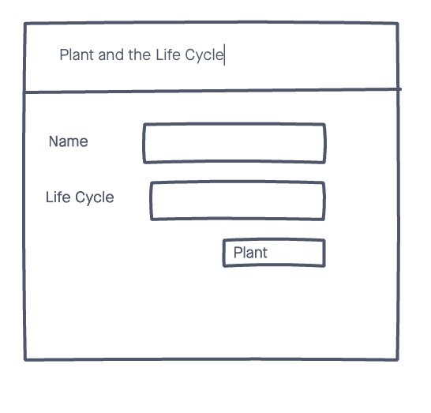
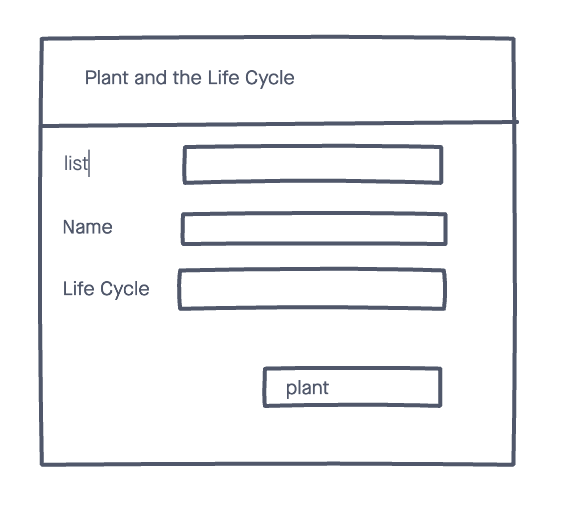
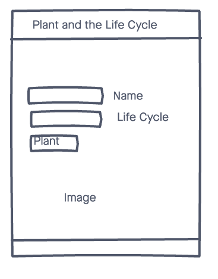

# Plant Log 💐

If you love plants and gardening this small web app is for you. My inspiration comes from my lovely wife, who loves planting and gardening. I thought that it would be nice to have place to get all the info you need about your plants and garden, based on your location.

## Technologies Used ⚙️

- CSS3
- HTML
- JS
- Mongoose
- Mongodb
- Express
- Github 
- Heroku (for deployment)

## Screenshots 📸

## Getting started 🚴🏽‍♂️

[Click](https://frontend-plant-log.herokuapp.com/) here to get started and see the app online!

## Future Enhancements  🛠  
- 3rd party api key
- ability to log in and log out
- add react routing (Informational page)
